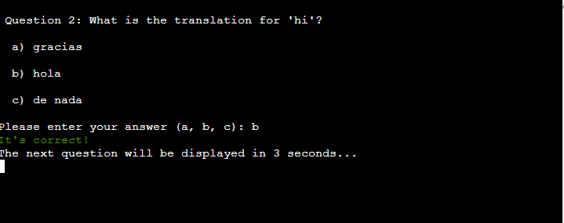
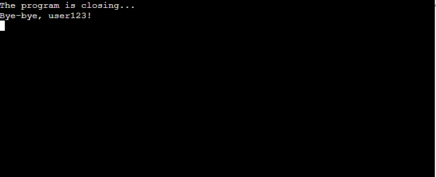

# [LANGUAGE QUIZ](https://language-quiz-8c94a99f5a81.herokuapp.com)

source: [amiresponsive](https://ui.dev/amiresponsive?url=https://language-quiz-8c94a99f5a81.herokuapp.com)

## UX

 - `RED` - error text or incorrect answer
 - `GREEN` - correct answer
 - `BLUE`- score color

## Features

### Existing Features

- **Start the program**

    - Greet a user and ask to enter username

- **Menu**

    - Display a menu and ask user to enter the number of action he wants to proceed with

- **Start Quiz - Choose language**

    - Display the language's options and ask user to enter the number of language he wants to proceed with

- **Quiz Questions**

    - Display question of chosen language's quiz and get an answer from the user. After get user's inputs - the feature display the result if the answer was correct or not.

- **Add score to score worksheet**

    - Display a user's score and ask him if he would like to see the whole score.

- **Show score table**

    - Display the whole score table and ask user if he would like to come back to menu.

- **Exit program**

    - Display a message to the user and stop the code.

### Future Features

- Level Language Quiz 
    - Add options to choose the hardness of quiz: Easy, Medium, Hard.
- More languages
    - Add more languages such as: Portuguese, Ukranian, Polish, Irish, Turkish.
- Sort score by languages
    - Show score by chosen language

## Tools & Technologies Used

-  used to generate README and TESTING templates.
-  used for version control. (`git add`, `git commit`, `git push`)
-  used for secure online code storage.
-  used as a cloud-based IDE for development.
-  used as the back-end programming language.
-  used for hosting the deployed back-end site.
-  used for storing data from my Python app.
-  used to help debug, troubleshoot, and explain things.

## Data Model

### Flowchart

To follow best practice, a flowchart was created for the app's logic,
and mapped out before coding began using a free version of
[Lucidchart](https://www.lucidchart.com/pages/ER-diagram-symbols-and-meaning) and/or [Draw.io](https://www.draw.io).

Below is the flowchart of the main process of this Python program. It shows the entire cycle of the program.

Source: [Mermaid](https://mermaid.live/edit#pako:eNplU9tymzAQ_ZWtnrGHW7DNQzvxpU7SxInjdjot-EEFxWYMkiuJNgn2v1cXu4EJT7C7Z885u0uDMpYTFKMNx_stfJ2mFNRzmawk5nINvd5HGCffSZmxioBkILcEbjHd1HhDYFkXrx_WFjI2tZNkRiXhUAvCKa7IKTkxyWlzLf5nIATGoWKcQEmkwohPR1s8NcWHH0QcYJastuwvVITWMRhNhtQBE15lCu7A7LmQ6w52wQ7wObkUO0OndRMjC1OmDLTkWdEpteiZ-Zwn3zSooPtaCsBA6-qX-n5SchW4UF0yWTB6YpwbzJW2ZhDwB5dFjiXJz36u3jRdWzuEc-2dCKGmaDXMO7XG-00zLXJrINsyJggIM4DfagDn3jet-i_J24Bs09tkYoHlaWPrDkoruntPohUKPdkzyV2LZGEdmPyp28Kk7xtrjcpCrbSDv2_jOyGt4KEZ42ynd6S3fMY8tI-gE9KYpTqzfN1RZ8LdRT6-80bUpZwZHlsMy05It1KcyEEV4RUucvV_NLoiReoAKpKiWL3mmO9SlNKjqsO1ZKsXmqFY8po4qN7rC5gWWP1WFYqfcClUdI8pihv0jOKeF1303TAcDge-5_leFPgOetHxQeD2IzdwLzx_ELkj3z866JUx1SToe8Ew9EfeKHDdMAjCyHT8aZKWlrN6sz3RHf8BOj8vxQ)

### Classes & Functions

The primary functions used on this application are:

- `clear()`
    - Clear the terminal.
- `get_username()`
    - Get a username from user.
- `validate_username()`
    - Validate if the user created the username which meets requirements.
- `user_action()`
    - Show options of actionns to the user and get a number of actiopn from user.
- `validate_user_action()`
    - Validate the input for action from user.
- `start_quiz()`
    - Show options of languages.
- `validate_lan_answer()`
    -  Validate the user's input for choose language question.
- `show_questions()`
    - Show the questions of the chosen language's quiz, gets the username's answers and calculate the score.
- `validate_answer()`
    -  Validate the user's inputs for quiz answers.
- `end_quiz()`
    -  Didplays the result of quiz.
- `add_score_to_score_sheet()`
    -  Add user's score to the score worksheet and ask a user if he would like to see the whole score table.
- `validate_answer_yes_no()`
    -  Validate user's input for the question where is answer yes or no
- `show_score()`
    -  Shows the whole score table.
- `exit_program()`
    -  Display bye message and and the program.
- `main()`
    - Run all program functions.

### Imports

I've used the following Python packages and/or external imported packages.

- `gspread`: used with the Google Sheets API
- `google.oauth2.service_account`: used for the Google Sheets API credentials
- `random`: used for shuffle the options of answers
- `time`: used for the pause code for some time
- `os`: used for the having access to cls command
- `colorama`: used for the coloring text

## Testing

> [!NOTE]  
> For all testing, please refer to the [TESTING.md](TESTING.md) file.

## Deployment

Code Institute has provided a [template](https://github.com/Code-Institute-Org/python-essentials-template) to display the terminal view of this backend application in a modern web browser.
This is to improve the accessibility of the project to others.

The live deployed application can be found deployed on [Heroku](https://language-quiz-8c94a99f5a81.herokuapp.com).

### Heroku Deployment

This project uses [Heroku](https://www.heroku.com), a platform as a service (PaaS) that enables developers to build, run, and operate applications entirely in the cloud.

Deployment steps are as follows, after account setup:

- Select **New** in the top-right corner of your Heroku Dashboard, and select **Create new app** from the dropdown menu.
- Your app name must be unique, and then choose a region closest to you (EU or USA), and finally, select **Create App**.
- From the new app **Settings**, click **Reveal Config Vars**, and set the value of KEY to `PORT`, and the value to `8000` then select *add*.
- If using any confidential credentials, such as CREDS.JSON, then these should be pasted in the Config Variables as well.
- Further down, to support dependencies, select **Add Buildpack**.
- The order of the buildpacks is important, select `Python` first, then `Node.js` second. (if they are not in this order, you can drag them to rearrange them)

Heroku needs three additional files in order to deploy properly.

- requirements.txt
- Procfile
- runtime.txt

You can install this project's **requirements** (where applicable) using:

- `pip3 install -r requirements.txt`

If you have your own packages that have been installed, then the requirements file needs updated using:

- `pip3 freeze --local > requirements.txt`

The **Procfile** can be created with the following command:

- `echo web: node index.js > Procfile`

The **runtime.txt** file needs to know which Python version you're using:
1. type: `python3 --version` in the terminal.
2. in the **runtime.txt** file, add your Python version:
	- `python-3.9.19`

For Heroku deployment, follow these steps to connect your own GitHub repository to the newly created app:

Either:

- Select **Automatic Deployment** from the Heroku app.

Or:

- In the Terminal/CLI, connect to Heroku using this command: `heroku login -i`
- Set the remote for Heroku: `heroku git:remote -a app_name` (replace *app_name* with your app name)
- After performing the standard Git `add`, `commit`, and `push` to GitHub, you can now type:
	- `git push heroku main`

The frontend terminal should now be connected and deployed to Heroku!

### Local Deployment

This project can be cloned or forked in order to make a local copy on your own system.

For either method, you will need to install any applicable packages found within the *requirements.txt* file.

- `pip3 install -r requirements.txt`.

If using any confidential credentials, such as `CREDS.json` or `env.py` data, these will need to be manually added to your own newly created project as well.

#### Cloning

You can clone the repository by following these steps:

1. Go to the [GitHub repository](https://github.com/dfedyachkina/language-quiz) 
2. Locate the Code button above the list of files and click it 
3. Select if you prefer to clone using HTTPS, SSH, or GitHub CLI and click the copy button to copy the URL to your clipboard
4. Open Git Bash or Terminal
5. Change the current working directory to the one where you want the cloned directory
6. In your IDE Terminal, type the following command to clone my repository:
	- `git clone https://github.com/dfedyachkina/language-quiz.git`
7. Press Enter to create your local clone.

Alternatively, if using Gitpod, you can click below to create your own workspace using this repository.

Please note that in order to directly open the project in Gitpod, you need to have the browser extension installed.
A tutorial on how to do that can be found [here](https://www.gitpod.io/docs/configure/user-settings/browser-extension).

#### Forking

By forking the GitHub Repository, we make a copy of the original repository on our GitHub account to view and/or make changes without affecting the original owner's repository.
You can fork this repository by using the following steps:

1. Log in to GitHub and locate the [GitHub Repository](https://github.com/dfedyachkina/language-quiz)
2. At the top of the Repository (not top of page) just above the "Settings" Button on the menu, locate the "Fork" Button.
3. Once clicked, you should now have a copy of the original repository in your own GitHub account!

### Local VS Deployment

## Credits

### Content

| Source | Location | Notes |
| --- | --- | --- |
| [Markdown Builder](https://tim.2bn.dev/markdown-builder) | README and TESTING | tool to help generate the Markdown files |
| [YouTube](https://www.youtube.com/watch?v=u51Zjlnui4Y) | PP3 terminal | tutorial for adding color to the Python terminal |
| [Geeks for Geeks](https://www.geeksforgeeks.org/clear-screen-python/) | PP3 Terminal | Help to build up claer() function |

### Media

| Source | Location | Type | Notes |
| --- | --- | --- | --- |
| [Google Translate](https://translate.google.com/) | Quiz section | text | Finsd the translation of words |

### Acknowledgements

- I would like to thank my Code Institute mentor, [Tim Nelson](https://github.com/TravelTimN) for his support throughout the development of this project.
- I would like to thank the [Code Institute](https://codeinstitute.net) tutor team for their assistance with troubleshooting and debugging some project issues.
- I would like to thank the [Code Institute Slack community](https://code-institute-room.slack.com) for the moral support; it kept me going during periods of self doubt and imposter syndrome.
- I would like to thank my partner (John/Jane), for believing in me, and allowing me to make this transition into software development.
- I would like to thank my employer, for supporting me in my career development change towards becoming a software developer.
