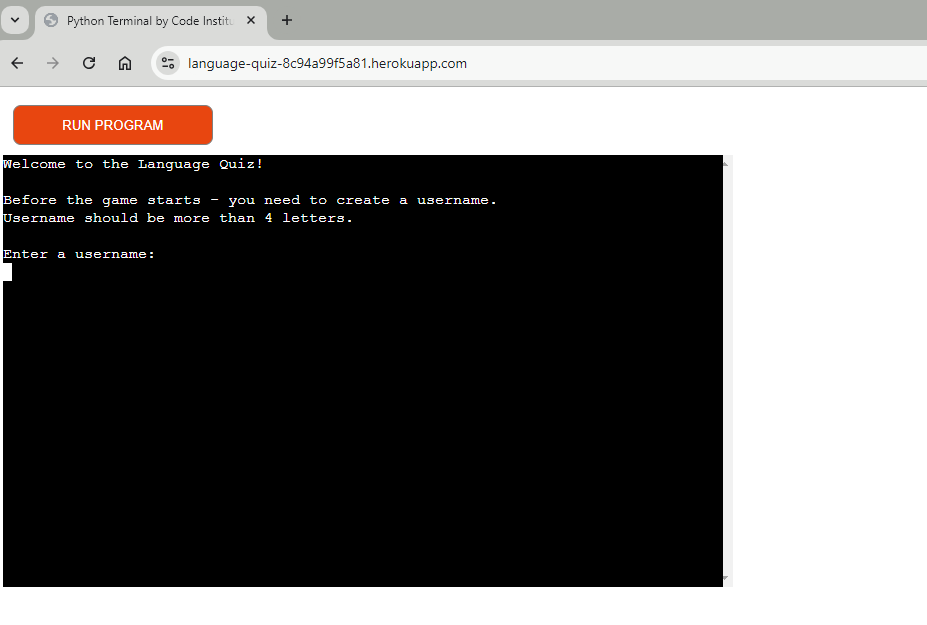
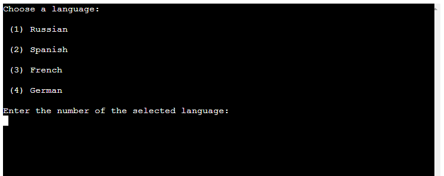

# Testing

> [!NOTE]  
> Return back to the [README.md](README.md) file.

## Code Validation

### Python

I have used the recommended [PEP8 CI Python Linter](https://pep8ci.herokuapp.com) to validate all of my Python files.

| Directory | File | CI URL | Screenshot | Notes |
| --- | --- | --- | --- | --- |
|  | run.py | [PEP8 CI](https://pep8ci.herokuapp.com/https://raw.githubusercontent.com/dfedyachkina/language-quiz/main/run.py) |  | |

## Browser Compatibility

I've tested my deployed project on multiple browsers to check for compatibility issues.

| Browser | Terminal | Notes |
| --- | --- | --- |
| Chrome |  | Works as expected |
| Firefox |  | Works as expected |
| Edge |  | Works as expected |

## Responsiveness

I've tested my deployed project on multiple devices to check for responsiveness issues.

| Device | Terminal | Notes |
| --- | --- | --- |
| Mobile (DevTools) |  | Works as expected |
| Tablet (DevTools) |  |  Works as expected |
| Desktop |  | Works as expected |

## Lighthouse Audit

I've tested my deployed project using the Lighthouse Audit tool to check for any major issues.

| Page | Mobile | Desktop | Notes |
| --- | --- | --- | --- |
| PP3 Terminal |  |  | Some minor warnings |

## Defensive Programming

Defensive programming was manually tested with the below user acceptance testing:

| Page | Expectation | Test | Result | Fix | Screenshot |
| --- | --- | --- | --- | --- | --- |
| Start the program | | | | | |
| | Feature is expected to do validation username and show error if the username is less than 4 letters when the user does input a username | Tested the feature by doing input username which less than 3 letters | The feature behaved as expected, and it did display error and ask user to enter username again | Test concluded and passed |  |
| | Feature is expected to do show display menu when the user does input a valid username | Tested the feature by doing input a valid username | The feature behaved as expected, it did show menu. | Test concluded and passed|  |
| Menu | | | | | |
| | Feature is expected to do display error and ask the user to enter valid number when the user does input unvalid number of action | Tested the feature by doing enter unvalid number of action | The feature behaved as expected, and it did display error | Test concluded and passed |  |
| | Feature is expected to do display choose language section when the user does enter a valid number of action | Tested the feature by doing enter a valid number of action | The feature behaved as expected, and it did choose language section | Test concluded and passed |  |
| Start Quiz - Choose language | | | | | |
| | Feature is expected to do display error and ask the user to enter valid number when the user does input unvalid number of action | Tested the feature by doing enter unvalid number of action | The feature behaved as expected, and it did display error | Test concluded and passed |  |
| | Feature is expected to do display quiz questions and start quiz when the user does enter a valid number of action | Tested the feature by doing enter a valid number of action | The feature behaved as expected, and it did display quiz questions and start quiz | Test concluded and passed |  |
| Quiz Questions | | | | | |
| | Feature is expected to do display error and ask the user to enter valid option's letter when the user does input unvalid option's letter | Tested the feature by doing enter unvalid option's letter | The feature behaved as expected, and it did display error | Test concluded and passed | |
| | Feature is expected to do display if the user guess the answer and go to the next question when the user does enter valid option's letter| Tested the feature by doing option's letter | The feature behaved as expected, and it did display the result if user guess or not and go to the next question | Test concluded and passed | |
| Add score to score worksheet | | | | | |
| | Feature is expected to show whole score table when the user does input "y" | Tested the feature by doing input "y"" | The feature behaved as expected, and it did show the whole score table | Test concluded and passed | |
| | Feature is expected to do show the message about program is closing when the user does enter "n"| Tested the feature by doing enter "n" | The feature behaved as expected, and it did display the mesagge that program is closing | Test concluded and passed | |
| | Feature is expected to do display error and ask the user to enter "y" or "n" when the user does input unvalid letter of action | Tested the feature by doing enter unvalid letter of action | The feature behaved as expected, and it did display error | Test concluded and passed | |
| Show Score | | | | | |
| | Feature is expected to back to menu when the user does input "y" | Tested the feature by doing input "y"" | The feature behaved as expected, and it did back to menu | Test concluded and passed | |
| | Feature is expected to do show the message about program is closing when the user does enter "n"| Tested the feature by doing enter "n" | The feature behaved as expected, and it did display the mesagge that program is closing | Test concluded and passed | |
| | Feature is expected to do display error and ask the user to enter "y" or "n" when the user does input unvalid letter of action | Tested the feature by doing enter unvalid letter of action | The feature behaved as expected, and it did display error | Test concluded and passed | |
| Exit Program | | | | | |
| | Feature is expected to do show a message and stop the program when the user chose the action "Exit" previously | Tested the feature by doing choose "Exit" action | The feature behaved as expected, and it did diaplay message and stop program | Test concluded and passed | |

🛑🛑🛑🛑🛑🛑🛑🛑🛑🛑-START OF NOTES (to be deleted)

Another way of performing defensive testing is a simple Pass/Fail for each test.
The assessors prefer the above method, with the full test explained, but this is also acceptable in most cases.

When in doubt, use the above method instead, and delete the table below.

🛑🛑🛑🛑🛑🛑🛑🛑🛑🛑-END OF NOTES (to be deleted)

| Page | User Action | Expected Result | Pass/Fail | Comments |
| --- | --- | --- | --- | --- |
| Home | | | | |
| | Click on Logo | Redirection to Home page | Pass | |
| | Click on Home link in navbar | Redirection to Home page | Pass | |
| Gallery | | | | |
| | Click on Gallery link in navbar | Redirection to Gallery page | Pass | |
| | Load gallery images | All images load as expected | Pass | |
| Contact | | | | |
| | Click on Contact link in navbar | Redirection to Contact page | Pass | |
| | Enter first/last name | Field will accept freeform text | Pass | |
| | Enter valid email address | Field will only accept email address format | Pass | |
| | Enter message in textarea | Field will accept freeform text | Pass | |
| | Click the Submit button | Redirects user to form-dump | Pass | User must click 'Back' button to return |
| Sign Up | | | | |
| | Click on Sign Up button | Redirection to Sign Up page | Pass | |
| | Enter valid email address | Field will only accept email address format | Pass | |
| | Enter valid password (twice) | Field will only accept password format | Pass | |
| | Click on Sign Up button | Asks user to confirm email page | Pass | Email sent to user |
| | Confirm email | Redirects user to blank Sign In page | Pass | |
| Log In | | | | |
| | Click on the Login link | Redirection to Login page | Pass | |
| | Enter valid email address | Field will only accept email address format | Pass | |
| | Enter valid password | Field will only accept password format | Pass | |
| | Click Login button | Redirects user to home page | Pass | |
| Log Out | | | | |
| | Click Logout button | Redirects user to logout page | Pass | Confirms logout first |
| | Click Confirm Logout button | Redirects user to home page | Pass | |
| Profile | | | | |
| | Click on Profile button | User will be redirected to the Profile page | Pass | |
| | Click on the Edit button | User will be redirected to the edit profile page | Pass | |
| | Click on the My Orders link | User will be redirected to the My Orders page | Pass | |
| | Brute forcing the URL to get to another user's profile | User should be given an error | Pass | Redirects user back to own profile |
| repeat for all remaining pages | x | x | x | x |

🛑🛑🛑🛑🛑🛑🛑🛑🛑🛑-START OF NOTES (to be deleted)

Repeat for all other tests, as applicable to your own site.
The aforementioned tests are just an example of a few different project scenarios.

🛑🛑🛑🛑🛑🛑🛑🛑🛑🛑-END OF NOTES (to be deleted)

## Bugs

🛑🛑🛑🛑🛑🛑🛑🛑🛑🛑-START OF NOTES (to be deleted)

This section is primarily used for JavaScript and Python applications,
but feel free to use this section to document any HTML/CSS bugs you might run into.

It's very important to document any bugs you've discovered while developing the project.
Make sure to include any necessary steps you've implemented to fix the bug(s) as well.

**PRO TIP**: screenshots of bugs are extremely helpful, and go a long way!

🛑🛑🛑🛑🛑🛑🛑🛑🛑🛑-END OF NOTES (to be deleted)

- JS Uncaught ReferenceError: `foobar` is undefined/not defined

    

    - To fix this, I _____________________.

- JS `'let'` or `'const'` or `'template literal syntax'` or `'arrow function syntax (=>)'` is available in ES6 (use `'esversion: 11'`) or Mozilla JS extensions (use moz).

    

    - To fix this, I _____________________.

- Python `'ModuleNotFoundError'` when trying to import module from imported package

    

    - To fix this, I _____________________.

- Django `TemplateDoesNotExist` at /appname/path appname/template_name.html

    

    - To fix this, I _____________________.

- Python `E501 line too long` (93 > 79 characters)

    

    - To fix this, I _____________________.

## Unfixed Bugs

🛑🛑🛑🛑🛑🛑🛑🛑🛑🛑-START OF NOTES (to be deleted)

You will need to mention unfixed bugs and why they were not fixed.
This section should include shortcomings of the frameworks or technologies used.
Although time can be a big variable to consider, paucity of time and difficulty understanding
implementation is not a valid reason to leave bugs unfixed.

If you've identified any unfixed bugs, no matter how small, be sure to list them here.
It's better to be honest and list them, because if it's not documented and an assessor finds the issue,
they need to know whether or not you're aware of them as well, and why you've not corrected/fixed them.

Some examples:

🛑🛑🛑🛑🛑🛑🛑🛑🛑🛑-END OF NOTES (to be deleted)

- On devices smaller than 375px, the page starts to have `overflow-x` scrolling.

    

    - Attempted fix: I tried to add additional media queries to handle this, but things started becoming too small to read.

- For PP3, when using a helper `clear()` function, any text above the height of the terminal does not clear, and remains when you scroll up.

    

    - Attempted fix: I tried to adjust the terminal size, but it only resizes the actual terminal, not the allowable area for text.

- When validating HTML with a semantic `section` element, the validator warns about lacking a header `h2-h6`. This is acceptable.

    

    - Attempted fix: this is a known warning and acceptable, and my section doesn't require a header since it's dynamically added via JS.

🛑🛑🛑🛑🛑🛑🛑🛑🛑🛑-START OF NOTES (to be deleted)

If you legitimately cannot find any unfixed bugs or warnings, then use the following sentence:

🛑🛑🛑🛑🛑🛑🛑🛑🛑🛑-END OF NOTES (to be deleted)

> [!NOTE]  
> There are no remaining bugs that I am aware of.
