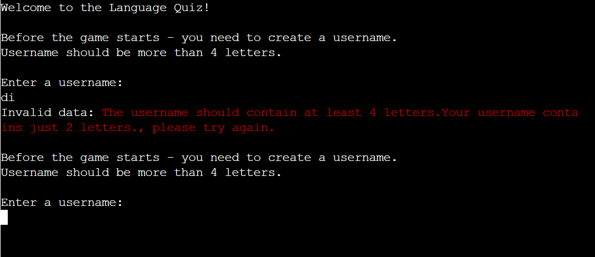
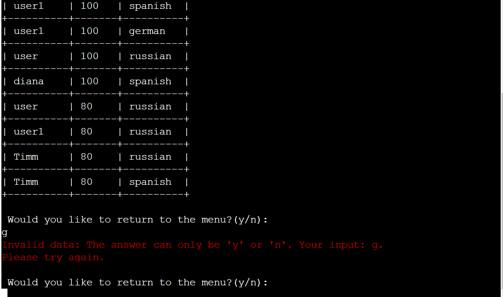

# Testing

> [!NOTE]  
> Return back to the [README.md](README.md) file.

## Code Validation

### Python

I have used the recommended [PEP8 CI Python Linter](https://pep8ci.herokuapp.com) to validate all of my Python files.

| Directory | File | CI URL | Screenshot | Notes |
| --- | --- | --- | --- | --- |
|  | run.py | [PEP8 CI](https://pep8ci.herokuapp.com/https://raw.githubusercontent.com/dfedyachkina/language-quiz/main/run.py) |  | |

## Browser Compatibility

I've tested my deployed project on multiple browsers to check for compatibility issues.

| Browser | Terminal | Notes |
| --- | --- | --- |
| Chrome |  | Works as expected |
| Firefox |  | Emojis in the Python terminal are cut-off for Firefox browsers |
| Edge |  | Works as expected |

## Responsiveness

I've tested my deployed project on multiple devices to check for responsiveness issues.

| Device | Terminal | Notes |
| --- | --- | --- |
| Mobile (DevTools) |  | Not responsive for mobile. IPhone's users are not able to enter anything in terminal, but Android's users are |
| Tablet (DevTools) |  |  Works as expected |
| Desktop |  | Works as expected |

## Lighthouse Audit

I've tested my deployed project using the Lighthouse Audit tool to check for any major issues.

| Page | Mobile | Desktop | Notes |
| --- | --- | --- | --- |
| PP3 Terminal |  |  | Some minor warnings |

## Defensive Programming

Defensive programming was manually tested with the below user acceptance testing:

| Feature | Expectation | Test | Result | Fix | Screenshot |
| --- | --- | --- | --- | --- | --- |
| Start the program | | | | | |
| | Feature is expected to do validation username and show error if the username is less than 4 letters when the user does input a username | Tested the feature by doing input username less than 3 letters | The feature behaved as expected, and it did display error and ask the user to enter username again | Test concluded and passed |  |
| The feature is expected to show the display menu when the user does input the valid username | Tested the feature by doing input the valid username | The feature behaved as expected; it did show the menu. | Test concluded and passed | ! [screenshot](documentation/features/feature01.png) |
| Menu | | | | | |
| The feature is expected to do a display error and ask the user to enter a valid number when the user does input an invalid number of action | Tested the feature by entering an invalid number of action | The feature behaved as expected, and it did a display error | Test concluded and passed |  |
| | Feature is expected to do display choose language section when the user does enter a valid number of action | Tested the feature by doing enter a valid number of action | The feature behaved as expected, and it did choose language section | Test concluded and passed |  |
| Start Quiz - Choose Language | | | | | |
| The feature is expected to do a display error and ask the user to enter a valid number when the user does input an invalid number of action | Tested the feature by entering an invalid number of action | The feature behaved as expected, and it did a display error | Test concluded and passed |  |
| | Feature is expected to do display quiz questions and start quiz when the user does enter a valid number of action | Tested the feature by doing enter a valid number of action | The feature behaved as expected, and it did display quiz questions and start quiz | Test concluded and passed |  |
| Quiz Questions | | | | | |
| | Feature is expected to do display error and ask the user to enter valid option's letter when the user does input unvalid option's letter | Tested the feature by doing enter unvalid option's letter | The feature behaved as expected, and it did display error | Test concluded and passed | |
| The feature is expected to display if the user guesses the answer and go to the next question when the user does enter a valid option's letter. | Tested the feature by doing the option's letter | The feature behaved as expected, and it did display the result if the user guesses or not and go to the next question | Test concluded and passed | |
| Add score to score worksheet | | | | | |
| | Feature is expected to show whole score table when the user does input "y" | Tested the feature by doing input "y"" | The feature behaved as expected, and it did show the whole score table | Test concluded and passed | |
| The feature is expected to show the message that the program is closing when the user does enter "n"| Tested the feature by doing enter "n" | The feature behaved as expected, and it did display the message that the program is closing | Test concluded and passed | |
| The feature is expected to do a display error and ask the user to enter "y" or "n" when the user does input an invalid letter of action | Tested the feature by entering an invalid letter of action | The feature behaved as expected, and it did a display error | Test concluded and passed | |
| Show Score | | | | | |
| | Feature is expected to go back to menu when the user does input "y" | Tested the feature by doing input "y"" | The feature behaved as expected, and it went back to menu | Test concluded and passed | |
| The feature is expected to show the message that the program is closing when the user does enter "n | Tested the feature by doing enter "n" | The feature behaved as expected, and it did display the message that the program is closing | Test concluded and passed | |
| The feature is expected to do a display error and ask the user to enter "y" or "n" when the user does input an invalid letter of action | Tested the feature by entering an invalid letter of action | The feature behaved as expected, and it did a display error | Test concluded and passed | |
| Exit Program | | | | | |
| The feature is expected to show a message and stop the program when the user chose the action "Exit" previously | Tested the feature by choosing the "Exit" action | The feature behaved as expected, and it did display a message and stop program | Test concluded and passed | |

## Bugs

- TypeError: `method` object is not subscriptable

    

    - To fix this, I added to the line brakets () after `get_all_values`
    `data = score_sheet.get_all_values`.

- AttributeError: `str` object has no attribute `uppercase`

    

    - To fix this, I putted `upper()` instead of `uppercase()`.

- Invalid data: B option doesn't exist, please enter a, b or c

    

    - To fix this, I putted `lowercase()` instead of `uppercase()`

- `Endless loop` in show_score action()

    

    - To fix this, I moved
    `back_to_menu = input("\n Would you like to return to the menu?(y/n): \n")`
    to inside `while` loop instead.

- `E501 line too long` (81 > 79 characters)

    

    - To fix this, I moved the text `"\n Would you like to return to the menu?(y/n): \n"` to next line and keep brackets - one on the above line and another one on the under line.

## Unfixed Bugs

- The terminal can clean only 24 lines maximum

    

    - Attempted fix: the Python terminal only clears 24 lines because it's tied to the terminal's internal configuration, which is beyond the scope of the Python environment itself. The terminal's default behavior for clearing lines is a predefined setting, likely related to the terminal's buffer or display configuration.
